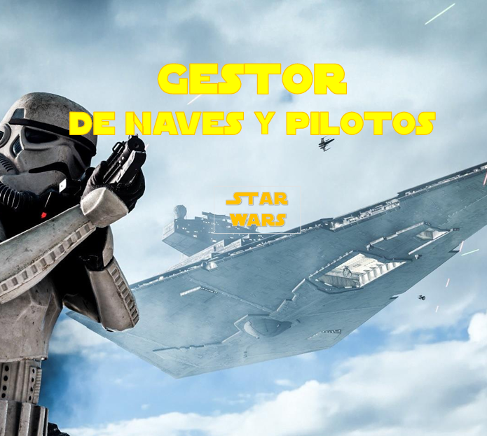

## Descripción

Este es un proyecto para gestionar una flota de naves del universo Star Wars. Permite añadir o eliminar pilotos a naves y gestionar las flotas de forma personal, a través de una interfaz de usuario sencilla y con la funcionalidad de la API REST de Laravel.

## Funcionalidades

- **Ver naves**: Muestra una lista de naves de Star Wars con su información básica (nombre, modelo, pilotos).
- **Añadir pilotos a naves**: Los usuarios pueden añadir pilotos a las naves de su flota.
- **Eliminar pilotos de naves**: Los usuarios pueden eliminar pilotos de su flota.
- **Paginación**: La lista de naves está paginada, mostrando un número limitado de naves por página.
- **Interfaz de usuario**: Desarrollado en Nuxt.js, utilizando componentes visuales para una experiencia interactiva.
- **Diseño responsivo e interactivo**: Interfaz construida con Nuxt y Tailwind CSS.
- **Autenticación con Laravel Sanctum**: Acceso protegido, login personalizado y login con Google.
- **Accesibilidad**: Navegación por teclado, roles ARIA, contraste accesible.
- **Visualización 3D con Three.js**: Renderizado de naves y pilotos en modelos `.glb`.

## Requisitos

### Backend

- **Laravel**: Framework PHP para la API REST.
- **MySQL**: Base de datos para almacenar la información de las naves, pilotos y usuarios.
- **Mailtrap** (pruebas de recuperación de contraseña).
- **Git LFS** (soporte para archivos pesados como `.glb` o `.mp4`).

### Frontend

- **Nuxt.js**: Framework basado en Vue.js para crear la interfaz de usuario.
- **Tailwind CSS** para controlar el diseño con clases utilitarias.
- **Nuxt UI**: componentes accesibles y estilizados.
- **Swiper.js**: carruseles responsivos para pilotos.
- **SweetAlert2**: integración de alertas bien visuales.
- **Font Awesome**: uso de iconos.
- **Three.js + GLTFLoader**: para visualizar elementos 3D (modelos).
- **Gestión de accesibilidad** con WAVE, Lighthouse y atributos ARIA.


## Instalación del proyecto

### Requisitos

- PHP 8.2 o superior
- Node.js 18+
- Composer
- MySQL o MariaDB
- Git

### Backend (Laravel)

```bash
git clone https://github.com/adriuno/starwars-backend.git
cd starwars-backend
composer install
cp .env.example .env
php artisan key:generate
php artisan migrate --seed
php artisan serve
```

```bash
git clone https://github.com/adriuno/starwars-frontend.git
cd starwars-frontend
npm install
npm run dev
```

## Autor

- **Adrián Ginel**  
  [gmadrian94@gmail.com](mailto:gmadrian94@gmail.com)

---

## Licencia

Este proyecto está licenciado bajo la licencia **Creative Commons Atribución-NoComercial-CompartirIgual 4.0 Internacional (CC BY-NC-SA 4.0)**.

Esto significa que:
- Puedes **compartir** y **adaptar** el proyecto siempre que des **crédito al autor**.
- **No puedes usarlo con fines comerciales**.
- Si haces modificaciones, debes **distribuirlo con la misma licencia**.

📘 Consulta los términos completos en:  
[https://creativecommons.org/licenses/by-nc-sa/4.0/](https://creativecommons.org/licenses/by-nc-sa/4.0/)


